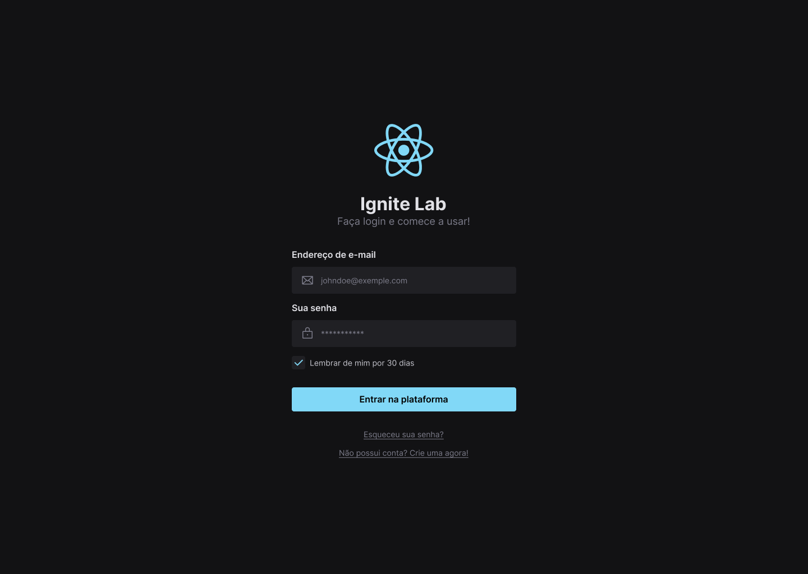
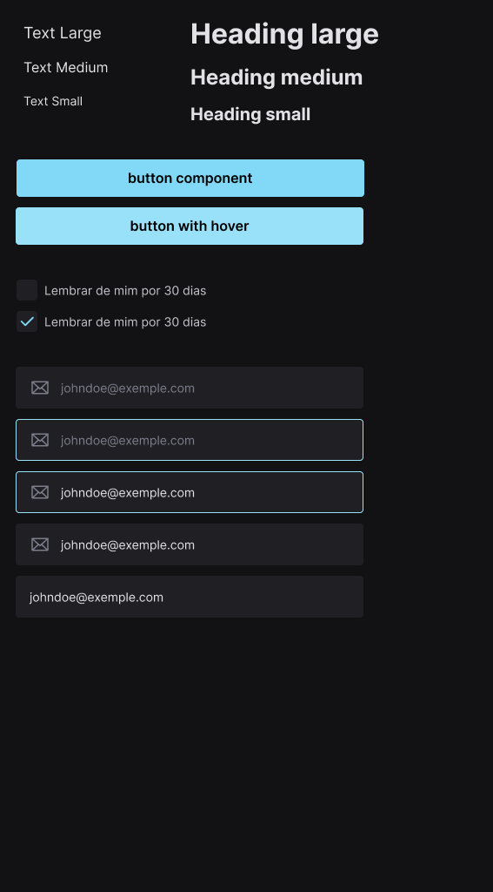

# NLW Ignite Lab - Do Figma ao React

Um design system desenvolvido desde a prototipação no figma ao react, utilizando o storybook para que possa consultar os componentes para utilizar no desenvolvimento de interfaces web.

## Estrutura dos componentes gerados

___

## Tecnologias 💻

-   [React](https://reactjs.org)
-   [Vite](https://vitejs.dev/)
-   [Tailwind CSS](https://tailwindcss.com/)
-   [Phosphor Icons](https://phosphoricons.com/)
-   [Typescript](https://www.typescriptlang.org/)
-   [Storybook](https://storybook.js.org/)
-   [Radix UI](https://www.radix-ui.com/)

___
